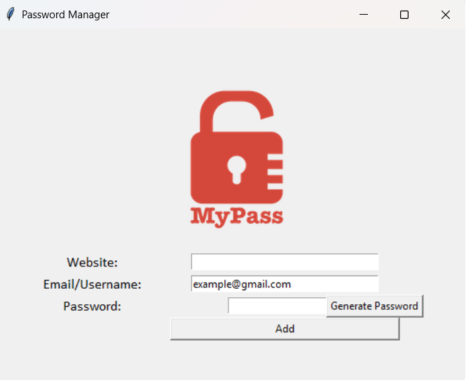

# 🔐 Password Manager - Python Tkinter App

This is a simple **Password Manager GUI application** built using Python and Tkinter. It allows you to generate secure passwords and store them locally in a JSON file along with the associated website and email/username. I made this project as a part of a Udemy course. So special Thanks to Dr. Angela Yu for guiding me step by step, to build this project. 

---

## 🧩 Features

- Generate strong, random passwords with letters, numbers, and symbols
- Store passwords securely in a local JSON file
- Easy-to-use graphical interface with Tkinter
- Autofill default email field
- Visual feedback using message boxes

---

## 📸 UI Preview

  

---

### ✅ Prerequisites

Before running the project, make sure Python is installed. Then install the required packages.

### 📦 Required Packages

Install using pip:

- tkinter
- json
- random

-----

This project will continue to improve over time with enhancements and refinements.
Thank you for visiting and checking out the project!

--Abhijeet--
